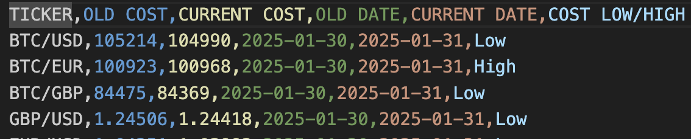
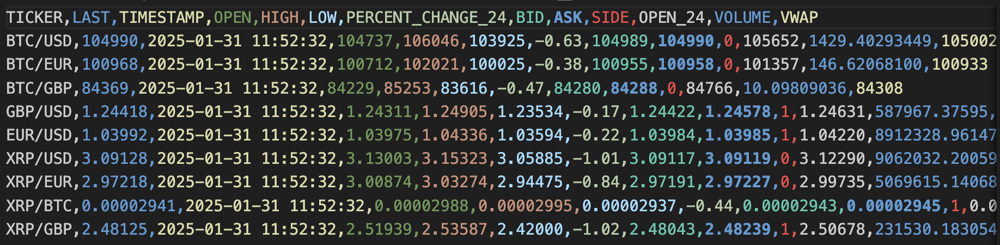

# Compare Tickers Cost

### Tickers Data

### Description

This tool helps us get live stock/crypto data and compare to same ticher's old price.

### Installation Guidelines
* Python
* PIP3

Get a public GET API url which can provide live tickers data.
* .env

Add following to the .env file.
* BASEURL=getapiurl
* IMPORTFILENAME=earlierdata.csv

#### Command to run
* python3 main.py

Exports folder will be created containing the following 2 csv files
* compared.csv
* data.csv